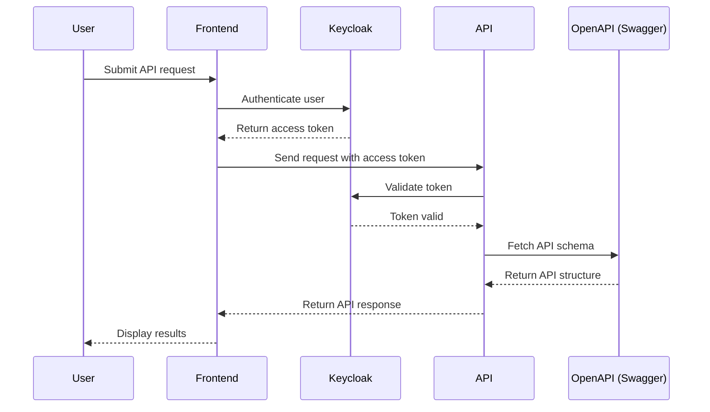

# 🚀 Science Wings - Multitenant & Multilanguage Internal Marketplace  

**ScienceWings** is a **multitenant** and **multilanguage** marketplace that helps organizations **share and reserve resources** seamlessly.  

It serves as a **great demonstration of using Keycloak** to build an **internal marketplace** for organizations while ensuring **secure authentication and authorization**.  

Additionally, this project showcases how to **leverage OpenAPI Generator** to **consistently generate the API communication layer in Angular**. This approach:  
✅ **Prevents resynchronization issues** between the frontend and backend  
✅ **Ensures the frontend always has the latest API client**  
✅ **Forces strict type-checking**—the frontend **won't build** if there’s a mismatch between data models or API calls  

---

## 🌍 Multitenancy & Multilanguage Support  

- **Multitenancy**: ScienceWings supports multiple organizations, allowing them to manage their own resources while keeping data isolated.  
- **Multilanguage Support**: Uses **Transloco** to provide a localized experience for users in different languages.  

---

## 📌 Prerequisites  

Before running the project, ensure you have:  
- [Node.js](https://nodejs.org/) installed  
- [Angular CLI](https://angular.io/cli) installed globally:  
  ```sh
  npm install -g @angular/cli
  ```
- A package manager such as `npm` or `yarn`  

---

## 📂 Project Structure  

```plaintext
/science-wings
│── .vscode/                  # VS Code settings
│── src/                      # Source code
│── .eslint.json              # ESLint configuration
│── angular.json              # Angular project configuration
│── package.json              # Project dependencies and scripts
│── README.md                 # Project documentation
│── tailwind.config.js        # Tailwind CSS configuration
│── proxy.config.json         # Proxy settings
│── transloco.config.js       # Translation settings
│── firebase.json             # Firebase deployment configuration
│── LICENSE.md                # License file
│── bitbucket-pipelines.yml   # Bitbucket CI/CD pipeline config
│── .gitignore                # Git ignore file
```

---

## 🚀 Getting Started  

### 🔧 Installation  

Run the following command to install project dependencies:  
```sh
npm install
```  

---

## 💻 Development  

### 🔥 Local Development Server  

Start a local development server with:  
```sh
npm run build:local
npm run start:local
```  
Navigate to **[http://localhost:4200/](http://localhost:4200/)** to view the app. The server will automatically reload when files are modified.  

### 🔄 Staging Development Server  

To run the app in a **staging environment**, use:  
```sh
npm run build:staging
npm run start:staging
```  

### 🌍 Production Build  

To generate a **production build**, run:  
```sh
npm run build:production
```  
This will generate the output files inside the `dist/` directory.  

---

## 🔄 Useful Scripts  

| Command                            | Description |
|------------------------------------|-------------|
| `npm run clean`                    | Removes `dist/`, `node_modules/`, and cache. |
| `npm run clean:windows`            | Runs the clean command on Windows (requires WSL). |
| `npm run generate-swagger`         | Generates API routes from the OpenAPI schema. |
| `npm run lint-and-fix`             | Runs ESLint and automatically fixes issues. |
| `ng generate component <name>`     | Generates a new Angular component. |
| `ng generate directive|pipe|service|module` | Creates various Angular constructs. |

---

## 🔐 Keycloak Authentication  

ScienceWings integrates **Keycloak** for secure authentication and access control. The authentication flow works as follows:  

1. The frontend redirects users to Keycloak for login.  
2. After successful login, Keycloak provides an **access token**.  
3. The frontend uses this token to authenticate API requests.  
4. The backend verifies the token before processing the request.  

This ensures **secure resource sharing** while **maintaining role-based access control (RBAC)** within an organization.

---

## 🔧 OpenAPI Generator for API Sync  

ScienceWings uses **OpenAPI Generator** to automatically generate TypeScript client services for API communication.  

### ✅ Benefits:
- **Ensures frontend and backend remain in sync**  
- **Automatically updates API clients when backend changes**  
- **Prevents build failures due to outdated API contracts**  

### ⚙️ How It Works:
1. The backend exposes an **OpenAPI schema** (Swagger).  
2. The frontend runs `npm run generate-swagger` to **regenerate API services**.  
3. If the API changes but the frontend isn’t updated, the build will fail, **forcing synchronization**.  

This approach **eliminates manual updates**, ensuring **accurate API communication**.

---

## 📊 Sequence Diagram  

The following **sequence diagram** shows the interaction between the **Frontend, API, and Keycloak**:



---

## 🛠 Tech Stack  

- **Angular 13**  
- **Keycloak for Authentication**  
- **Multitenancy Support**  
- **Transloco for Multilanguage Support**  
- **Tailwind CSS for Styling**  
- **Firebase for Hosting**  
- **RxJS for State Management**  
- **OpenAPI Generator for API Sync**  
- **Swagger API Integration**  

---

## 📜 License  

This project is licensed under the **GPLv3**. See [LICENSE.md](LICENSE.md) for details.  

---

## 📖 Additional Resources  

- [Angular CLI Documentation](https://angular.io/cli)  
- [Keycloak Documentation](https://www.keycloak.org/)  
- [OpenAPI Generator](https://openapi-generator.tech/)  
- [Swagger Docs](https://swagger.io/)  
- [Fuse Angular Template](https://fusetheme.com/)  
- [Tailwind CSS Docs](https://tailwindcss.com/)  
- [Transloco Documentation](https://ngneat.github.io/transloco/)  

For further assistance, run:  
```sh
ng help
```  
